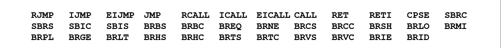
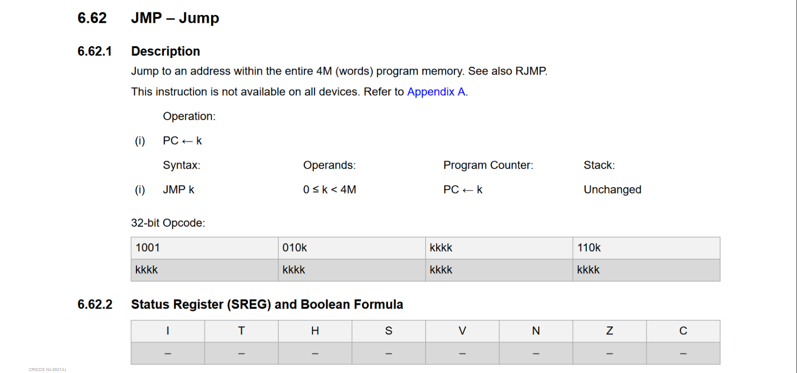
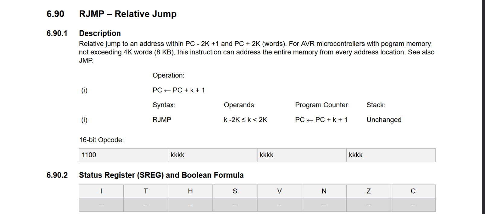
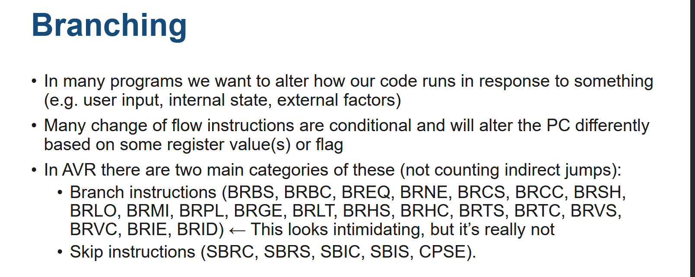
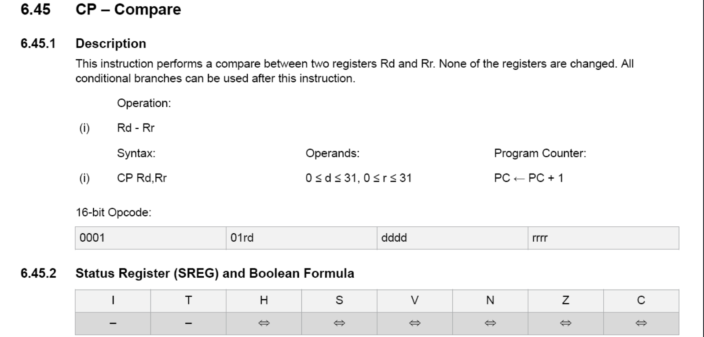
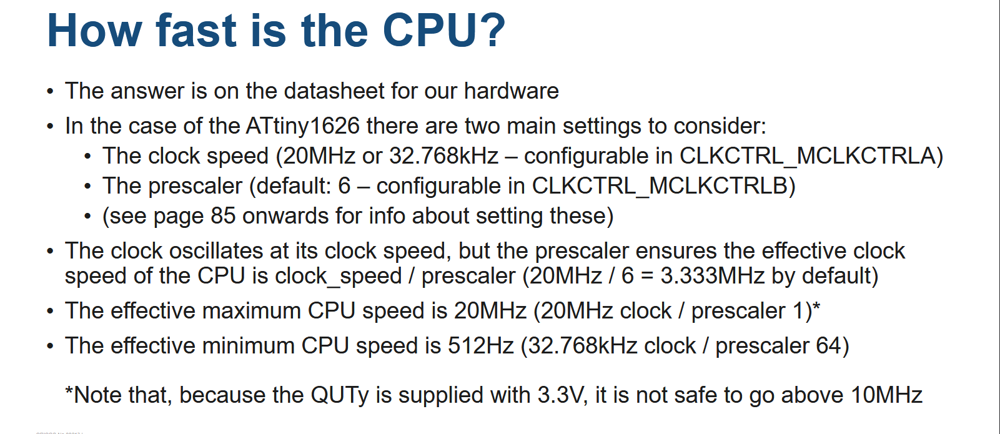
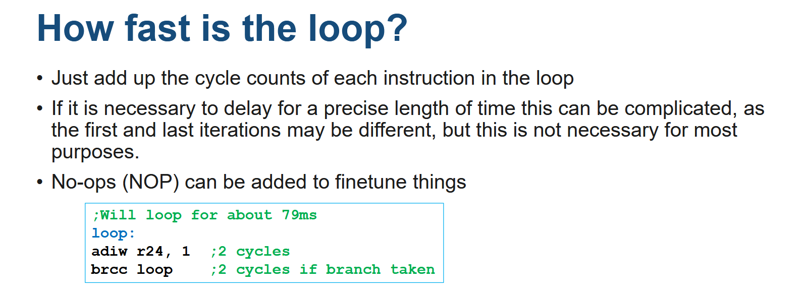
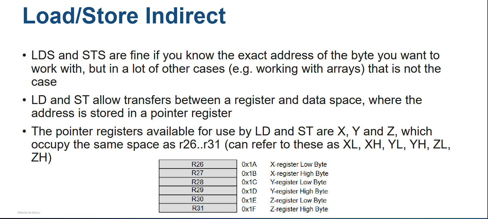
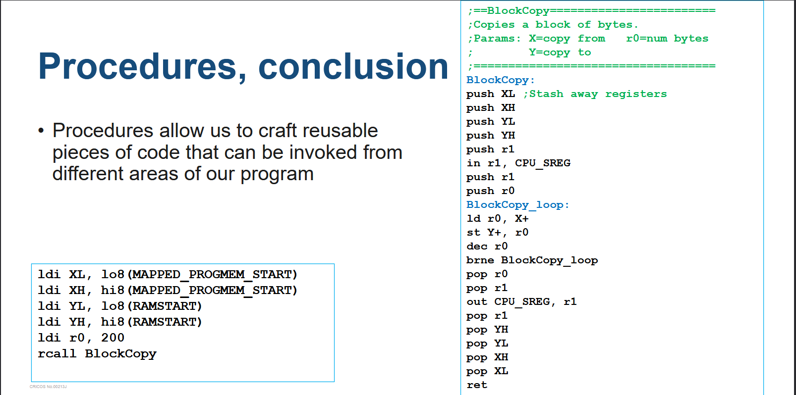

# Week4- Content
- Assembly
- [x] Flow Control
- [x] Loops
- [x] Memory and I/O
- [x] Stack
- [x] Procedure
- [x] Quiz IV

## Flow Control

AVR has many change of flow instructions:

\\

\\
**Labels**\\
- Most change of flow instructions take an address in program memory as a
parameter
- The assembler helps us out here with labels
```c

ldi r16, 0
jmp somewhere
ldi r16, 1 // ;This is skipped
somewhere:
push r16
```
- When a label: appears in our source code, the assembler will replace
references to it with the location of the instruction/directive immediately following
the label. Labels can address program memory or RAM

\\
- Most of the time we will be jumping between locations that are much closer
together (also, most of the time we do not want to spend a 32 bit instruction or 3
CPU cycles on a jump instruction)


\\
code: 
```c
ldi r16, 0
rjmp somewhere
ldi r16, 1 // ;This is skipped
somewhere:
push r16
```
- The assembler will error if the jump is **too far to represent**
- The range covered by **RJMP** is large enough for most purposes, especially with 16K of flash.

\\
## Branching
\\

\\
+ Branch Instruction:
  - Checks if a specified flag in SREG is cleared/set
  - If so, jump to a relative location (PC <= PC + k + 1)
  - Otherwise, the next instruction is executed as normal (PC <=PC + 1)
  -  Covers a narrower range than RJMP (-64 ≤ k ≤ +63)
    
==>**Skip Instructions**
    - Compares two registers for equality (CPSE) or checks if a bit in a register (SBRC/SBRS) or I/O register (SBIC/SBIS) is cleared/set
    - Otherwise, the next instruction is executed as normal (PC <=PC + 1)
    - There are 20 branch instructions listed in the AVR instruction set summary, but in reality, there are only two instructions:
        - **BRBC** – Branch if Bit in SREG is Cleared
        - **BRBS** – Branch if Bit in SREG is Set
    - The other instructions are there to allow more readable assembler programming, but assemble into the same opcodes
    - As these check bits in SREG, they are usually preceded by an ALU operation (e.g. CP, CPI)
    - Only 7 bits are allocated to the destination, so only short jumps can be made. Longer jumps usually involve jumping to a label with an RJMP or JMP
\\

    \\
### Branch instruction example
```c

cpi r16, 100
brge is_larger // ;Branch if greater or equal (branches if S is cleared)
// ; If r16 is less than 100 this code is run
…
rjmp common
is_larger:
 // ; If r16 is greater than or equal to 100 this code will run
common:
```
\\
### Skip Instructions
\\
- The skip instructions (CPSE, SBRC, SBRS, SBIC, SBIS) are less flexible than
the branch instructions, but can sometimes do the same job with less space /
fewer cycles

+ Compare:
```c
  cp r16, r17 // ;1 cycle, 2 bytes
breq equals // ;2 cycles, 2 bytes
… // ;Skipped if r16=r17
equals:
```
compare to:
```c
cpse r16, r17 // ;2 cycles*, 2 bytes
…// ;Skipped if r16=r17
```
- SBIC/SBIS (Skip if Bit in I/O register is Cleared/Set) can check individual bits from the 32 lower I/O registers, which can be good value as none of the instructions that read from I/O or data space touch SREG, meaning more instructions are required to branch
- Compare this code from Tutorial 3:
```c
in r17, VPORTA_IN // ;1 cycle
andi r17, PIN4_bm // ;1 cycle
cpi r17, 0 // ;1 cycle*
brne end_loop_100ms // ;2 cycles†
ldi r16, PIN5_bm // ;1 cycle
sts PORTB_OUTTGL, r16 // ;2 cycles
end_loop_100ms:

// COMPARE TO : //
ldi r16, PIN5_bm  // ;1 cycle
sbis VPORTA_IN, 4 //  ;3 cycles‡
sts PORTB_OUTTGL, r16  // ;2 cycles 
```
*Technically not necessary at all, as ANDI sets Z flag which is all BRNE needs
†2 cycles if the branch is taken, 1 cycle if not
‡3 cycles if the instruction is skipped (STS is a 32 bit instruction so the skip takes longer), 1 cycle if not

## Loops 
- By jumping to an earlier address, you can run instructions multiple times:
```c
loop:
ldi r16, PIN5_bm
sts PORTB_OUTTGL, r16
rjmp loop
```
> Delay loops
- Conceptually very simple: you create a loop that increments or decrements a register until it reaches a particular value, then you terminate the loop
- However, in order to create delay loops that are precisely timed, you need to know two things:
            - **How fast is the CPU**?
            -  **How many cycles does each iteration of the loop require?**
- This can be complex to determine precisely

  \\
  
  \\
  
  \\
## Memory and I/O
- Data space instruction
  + LDS and STS: Load/Store Direct from/to Data Space
  + LD and ST: Load/Store Indirect
  + PUSH and POP: Stack operations
  + IN and OUT: Single cycle I/O register operations*
  +  SBI and CBI: Set/Clear Bit in I/O Register*
* These operate on memory, but can only access the low 64 (for IN/OUT) or 32
(for SBI/CBI) bytes, which means they can access a portion of the I/O register
space and nothing else. These instructions are why VPORT{A,B,C} exist.

\\

\\
> Standard form
```c
ldi XL, lo8(RAMSTART) // ;Low byte of X (aka r26)
ldi XH, hi8(RAMSTART) // ;High byte of X (aka r27)
ld r0, X
st X, r1
```
> Post-increment form
```c
// ;Copy 100 bytes from X to Y
ldi r16, 100
loop:
ld r0, X+ // ;Loads into r0, then X ← X+1
st Y+, r0 // ;Stores from r0, then Y ← Y+1
dec r16
brne loop
```
> Pre-decrement form
```c
ld r0, -Z // ;Z ← Z-1, then loads into r0
st –X, r0 // ;X ← X-1, then stores from r0
```
- Any of these can be used with X, Y or Z and r0..r31
-  Only postincrement and predecrement exist (no preincrement or postdecrement)
  
## Stack
```c
push ZL // ;Stash these registers temporarily (+1 on the stack)
push ZH
// ;Now I can use Z for something (e.g. IJMP)
pop ZH //;Restore their previous values (-1 on the stack)
pop ZL
```
## Procedure
- A powerful tool for writing modular, reusable code, which makes them vital when working on nontrivial programs
- Usually associated with high level languages, but available from assembler as well
- The typical instructions are **(R)CALL**and **RET** (**CALL** is the 32-bit form. **RCALL** is the 16-bit form with relative addressing, similar to JMP and RJMP)
- CALL pushes PC + 1 onto the stack, then jumps to the given address. **RET** pops the address off the stack, storing it in PC (as a result jumping back to the instruction after the original CALL.)\\
  
  > Procedure, saving content, example
```c
//;Wait until any button is pressed
WaitForButton:
push r0 // ;Save r0
in r0, CPU_SREG
push r0 //;Save CPU.SREG
WaitForButton_loop:
in r0, VPORTA_IN
ori r0, 0b00001111
com r0 // ;One’s complement
breq WaitForButton_loop
pop r0
out CPU_SREG, r0 // ;Restore CPU.SREG
pop r0 // ;Restore r0
ret
```
  \\
  

# Quiz IV
1. What is the instruction to branch if the Z bit in CPU.SREG is set? 
```c
 X brne
 - breq //Ans
 X brcs
 X brcc
```

2. I want to make the QUTy run at 10MHz, what do I set the clock prescaler to? 
```c
//Ans: 2
```

3. ld r0, X+ does what? 
```c
//Ans:  Transfers a byte from X's location r0 to r0, then increments X
```

4. I want to drive SPI MOSI (PC0) and SPI CLK (PC2) high, and not change any other bits of PORTC.  Which is fastest?
```c
//Ans: SBI each pin separately
```

5. How many seconds (round to nearest) does this take (default clock settings and all registers start at 0).

```c
loop:
    adiw r24, 1
    adc r23, 0
    brcc loop

//Ans: 25
```


6. How many bytes does this add to the stack?

```c
    rcall label_a
    
label_a:
    rcall label_b
    
label_b:
    push r0

//Ans: 5
```

[^1]
[[week6-content]] Week 6- Content
[^1]: 
