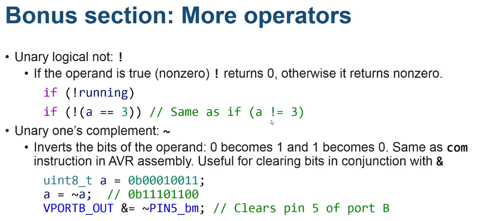

# Week 6- Content
- [x] Pointer and memory
- [x] Arrays
- [x] Functions
- [x] Scope and time line

## Pointer and memory

In c pointer are declared as "pointing to" an object of another type:
**Example**:

```c
uint8_t *ptr; //pointer to uint8_t
```
- This code declares a variable 'ptr', but this variable is not a uint8_t. It's a pointer that can be used to point to a uint8_t
- If a pointer is pointing at another variable, it is considered to be referencing that variable
  
### Addressing 

- Pointers can be declared with a specific address if we know exactly the location we want to access:
  **Example**:
```c
voltile uint8_t *prt= 0x0421; ptr points to PORTB DIRSET
```
* However most of the time we want pointers to point to the address of something (e.g. a variable)

  **Example**
  
```c
uint8_t a;
uint8_t *b = &a; // b points to a

// When we declare the variable 'a', the compiler reserves a location in memory for it (on the stack, in SRAM etc.) The & operator returns that memory address.
```
### Dereferencing

+ Once you have a pointer, you can access the memory at the location it\
references, either for reading or writing
+ This is accomplished in C through the unary dereference operator \*
+ The dereference operator can be used to accomplish the same thing as the load and store indirect instructions in AVR assembly (ld and st)
  
**Example**
```c
uint8_t a =123;
uint8_t *b = &a; // b points to a 
uint8_t c = *b; // c contains 123
*b = 0; // now a contains 0 (c is unchanged)

```
### Qualifiers
- Type qualifiers (const, volatile etc.) can be used with pointers as well
- Typical use is for the qualifier to apply to the value being pointed to, not the pointer type itself

```c
const uint8_t a =100, c= 50;
const uint8_t *b= &	a; // pointer to const uint8_t
b= &c // pointer it self can change
```
### Pointer arithmetic 

- Pointers can be changed with arithmetic operators (like +, -)
- Arithmetic on pointers affects the address. So this will make the pointer point to a different location
- One difference compared to normal integer types is that pointer  arithmetic works in multiples of the size of the underlying type:
```c
voltile uint_16 *ptr =0x0420;
ptr +2; // Now points to 0x0424 (+4 because it we are working with 16 bit)
```


### Pointer to void 
- Sometimes a pointer may need to point to a memory address, but has no knowledge of the type at that address
- For this purpose, the special non-type void is used as a pointer type:
```c
  void \*ptr;
```
- Void pointers have no underlying type and cannot be dereferenced
- Pointers of other types can be converted to/from void pointers without casting
```c
  int a = 3;
  void \*ptr = \&a;
```
- It is an error to convert a void pointer into a pointer that is not the same as the original type the pointer had

## Bonus section


## ARRAYS

```c
unit8_t array [10]; // creates an array of 10 uint8_ts
unit8_t array []={1,2,3,4,5}; // 

char hell0[]= "hello world\n";
//This is functionally equivalent to:
char hell0[]= {'h','e',---};
```
* This is different from
```c
   const char *hello = "Hello world\n";
```
- The former allocates 13 bytes of SRAM and initialises it with the contents of the string literal, which means it can be modified later
- The latter allocates a pointer and points it to the string literal (which is likely in constant storage somewhere, e.g. in flash) which can't be modified
  
### Indexing

- Values in an array can be accessed with the array index operator $[\ ]$
- Arrays in C are zero-based, which means an array of 10 items will have values at indices 0 through to 9:
```c
uint8_t array[] = {1, 2, 3, 4, 5};
uint8_t a = array[0]; // a contains 1
array[2] = 10; // array now contains {1, 2, 10, 4, 5}
```
- It is undefined behaviour to access any element outside of the array's valid range. It is, however, legal to have a pointer to an element one after the end of an array, as long as you do not dereference it:
  ```c
  uint8_t *b = &array[5];
  ```
  - Arrays are commonly used with loops:
    
```c
uint8_t array[10];
// Fill array with values 0 to 9
for (uint8_t i = 0; i < 10; i++) {
array[i] = i;
}
```
### Array and pointers 
```c
uint8_t array []= {1, 2,3}
uint *b= array;
*b= 5;// array noe contains {5, 2, 3}
```
Almately 
- The array indexing operator [ ] can be used on pointers:
  
```c
uint8_t array[] = {1, 2, 3};
uint8_t *b = array;
b[1] = 4; // array now contains {1, 4, 3}
```
- pointer[index] is the same as *(pointer + index)

## Functions 

- Functions in C have to be declared at the top level of a C program (that is, not
inside another function)
-  A function declaration has the form:
  
```c

return_type function_name(arguments) {
function_body
}
```

**Example :**
```c
uint16_t square(uint16_t val)
{
return val*val
}
```
### Arguments
- Arguments are used to provide information to a function when calling it. These arguments are made available to that function as local variables:
```c
uint6_t area(uint8_t w, uint8_t h)
{
return w*h
}
```
* we can call this function, passing those arguments:
```c
uint16_t a= area(10, 15);
```
### Passing arrays to functions

- Most types can be used in function arguments normally, but arrays are special
- Arrays cannot be passed to functions directly. While this syntax is legal:
```c
uint8_t average(uint8_t array[]) {

```
- …in a function declaration this actually declares a pointer and is the same as writing 
```c
uint8_t *array
``` 
- Instead, the standard approach is usually to have a function take a pointer and a size (or have some other mechanism for determining how long the array is):
```c
uint8_t average(uint8_t *array, uint16_t len) {
```
- This is also why strings are 0-terminated

### Return Values

- Most types (once again, arrays are an exception) can be used as return values for a function
- The 'return' keyword is used to indicate that a function is to  terminate and return that particular value to the caller
-  Multiple instances of 'return' can be present in a function. Any of them will cause the function to terminate and return the provided value to the caller

```c
uint8_t is_valid(uint8_t hour, uint8_t min) {
if (hour < 0 || hour > 23) return 0;
if (min < 0 || min > 59) return 0;
return 1;
}
```
### Functions without return values

- The non-type 'void' is used to indicate that a function does not return any value

```c
void display_decimal(uint8_t val) {
```
- A function returning void does not require the use of the 'return' keyword; however, it can be used without arguments
```c
void display_decimal(uint8_t val) {
if (val < 0 || val > 99) return;
display_hex((val / 10) << 4 | (val % 10));
}
```
### Function Prototypes
-To make it possible for C to generate the code required to call a function without having to specify the entire function first, C has function prototypes
- A function prototype consists of the function's return type, name and argument types, but not the body of the function
  
```c
void display_decimal(uint8_t);
```
- The compiler can use the information in the function prototype to generate the code required to call that function without needing to know what code is in the function yet
- The linker (the last step in the compilation process) will then resolve all function calls and connect them to the correct functions
- Argument names are optional in a function prototype, but are often included for documentation purposes
```c
void display_raw(uint8_t left, uint8_t right);
```
### Passing by reference

- C has a function 'scanf', which reads input according to a format string and stores the values into variables
- To achieve this, variables are passed by reference through pointers
- On the QUTy, scanf reads input from the serial point:
```c
printf("What number should I display?\n");
int num;
scanf("%d", &num);
display_decimal(num);
```
## Scope and lifetime

- Variables and other identifiers in C have **scope**
- Scope affects the **visibility** and **lifecycle** of variables
-  Scope is hierarchical; variables declared in an outer scope are visible to code
running in an inner scope, but not vice versa
-  Variables declared in an inner scope can **hide** variables in an outer scope with the same name (the variables still exist, but cannot be seen from code running in the inner scope)
-  Variables declared at the top level of your code (not inside functions) have
global scope and are known as global variables

```c
uint8_t global = 0;
uint8_t my_function(void)
{
global += 3;
return global;
}
```
- Functions in C all have global scope, as functions cannot be declared inside
other functions (this still works in many compilers, but is not standard)

- Global variables have certain unique properties compared to local variables
(variables declared inside functions)
    - They are allocated a fixed location in SRAM – as you declare global
        variables you will see the SRAM usage reported by the compiler increase.
        They do not go on the stack
    - They can be seen from anywhere in your code unless otherwise hidden

```c
uint8_t a = 0;
uint8_t my_function(void)
{
uint16_t a = 1; // Hides the global 'a'
a += 3;
return a;
}
```
## Static local variables
- The static qualifier can be applied to local variables*, which changes their
lifetime, but not their scope
- Static local variables have a fixed location in memory (not on the stack) and
their lifetime is the duration of the program, like global variables
- Only one copy of a static local variable exists, even if the function is called
recursively

```c
uint8_t counter(void)
{
static uint8_t count = 0;
return ++count;
}
```
## Block scope

- There are more levels of scope inside
functions
- Variables declared inside blocks (inside the body of if / else statements, while / do-while / for loops etc.) are scoped within that block and have a lifetime that ends when the block ends
- You can declare a block with { } in order to create a new level of scoping without needing a loop or if statement
  
```c
if (paused) {
uint8_t btn = !(VPORTA.IN &
PIN7_bm);
if (btn) paused = 0;
}
uint8_t a = 3;
do {
uint8_t a = VPORTA.IN & PIN4_bm;
} while (a);
display_decimal(a); // Displays 3
uint8_t b = 1;
{
uint8_t b = 2;
}
```
- Variables declared in the header of a for loop are scoped within the for loop, but in a second block of scope outside the body of the for loop (so your loop index variable can be hidden by a variable of the same name declared in your for loop)
```c
for (int i = 0; i < 49; i++) {
int i = i * 2;
display_decimal(i);
}
```


[^1][^1]: read AVR gcc calling convention (**GNU WRITING ARTICLE**)
