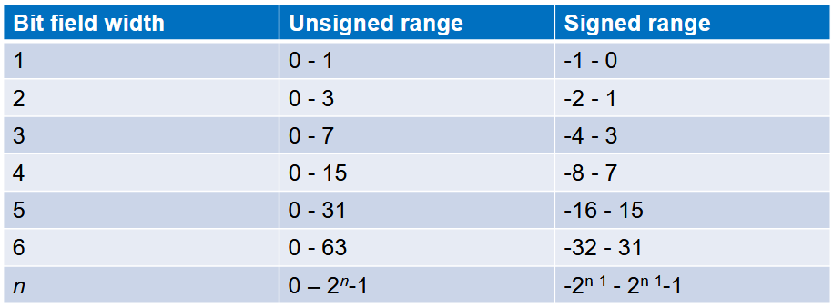
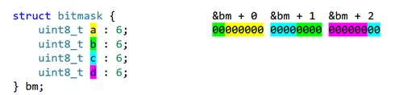
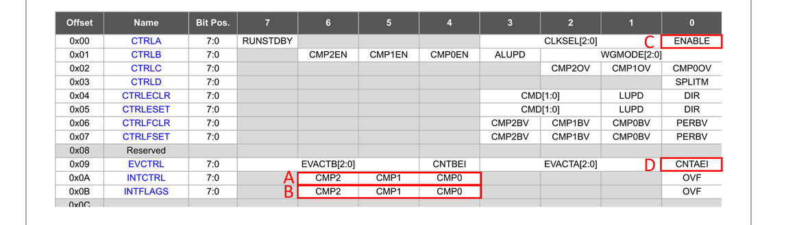

# Week 7 - Accessing registers 
 <CONTENTS> 
     
- [x]  Types and memory manipulation
- [x]  Interrupts
- [x]  compilation and modular Programming

    
## Types and memory manipulation

### Accessing registers

- [ ] - We can use pointers to directly reference memory locations by address, and access their contents. This allows us to make use of memory-mapped IO

```c
Volatile uint8_t *portb_outclr =0x0426

*portb_outclr =0b0010000; // pin 5 // by adding * at the start this indicates that we are changing the value in the location 0x0426 but ** NOT ** the location itself.

/*___VOlatile___*/

#include <stdio.h>
int main() {
    int non_volatile_variable = 0;
    volatile int volatile_variable = 0;
    while (1) {
        non_volatile_variable++; // Compiler might optimize this away
        volatile_variable++; // Compiler won't optimize this away
        printf("Non-volatile variable: %d\n", non_volatile_variable);
        printf("Volatile variable: %d\n", volatile_variable);
    }
    return 0;
}
```
- the **Volatile** is important here because the volatile we are modifying is outside the control of our program
- The <avr/io.h> herder file include a lot of processor directives and the types definitions to make using the ATtiny1626 from c easier
  eg:
```c
if (~VPORTA.IN & PIN5_bm){
		// button is pressed 
```
### Casting

Casting in C is the process of converting one data type into another. It allows you to explicitly change the data type of a value or expression to another data type. Casting is sometimes necessary when you want to ensure proper type compatibility or perform specific operations that require different data types to be compatible.

There are two main types of casting in C:

**Implicit Casting (Type Coercion):** This occurs automatically when the C compiler converts a value from one data type to another without requiring explicit casting by the programmer. Implicit casting typically happens when you mix different data types in expressions or assignments. For example:
```c
int x = 5;
double y = x; // Implicit casting from int to double
```

**Explicit Casting:** This type of casting requires the programmer to specify the desired type conversion explicitly by using a casting operator. The casting operator is the target data type enclosed in parentheses. For example:
```c
double a = 5.7;
int b = (int)a; // Explicit casting from double to int
```
⇒ Explicit casting is often necessary when you want to change the type of a value or expression in a way that the C compiler would not do automatically. However, you should be cautious when using explicit casting because it can lead to loss of data or unexpected behavior if the conversion is not done carefully.


- To force a conversion between two types, C has the unary **casting** operator
- Casting looks like this: (new_type) value
  
```c
volatile uint8_t *ptr = (volatile uint8_t *)0x0421;
```
- Complicated operator; does different things depending on context


### Types of casting 
- Conversions between numeric types (signed or unsigned) will expand or narrow the type, causing the value to be truncated if the new type does not support it:
```c
(uint8_t)-3 // 253

```
- Conversion from float to integer will round towards 0
```c

(int16_t)-3.45 // -3
```
- Conversion between pointers will change the pointer type but will not affect the underlying data. Note that these types of conversions may be unportable:
```c

uint16_t a = 12345;
uint8_t *b = (uint8_t *)&a; // likely contains 57
```

- Casting from integer to pointer will make the pointer contain the address in that integer. Likewise, casting from pointer to integer will store that pointer's address in the integer
-  Conversions between integers and pointers are not portable, but may be necessary when working on devices with MMIO anyway:

```c

volatile uint8_t *vportb_dir = (volatile uint8_t *)0x0004;
``` 
- Casting can be used to add/remove qualifiers (const, volatile etc.) from pointers. Removing const then modifying the underlying variable may result in undefined behaviour:
```c

const uint8_t a = 3;
const uint8_t *b = &a;
*((uint8_t *)b) = 4; // Never do this, it won't work anyway
```


### Casting and avoid truncation
- Another use for casting is to force a conversion in the middle of an expression where it may be needed. For example:
```c
uint16_t a = 25000, b = 10000;
uint32_t c = a * b; // Result is truncated
```

- In the above example, because a and b are uint16_t, the result of their
multiplication is also uint16_t and the multiplication result is truncated before it is stored into c. To fix this, cast one side of the multiplication. Because the result of arithmetic operators has the same type as the widest of the two operands' types, this will avoid truncation:
```c

uint32_t c = (uint32_t)a * b; // Works correctly
```
### Structs
- A struct is a programmer-defined aggregate type in C
- Typically declared with the form:
```c
struct coord{
uint8_t x;
uint8_t y;
};

```
- This will declare a new type called 'struct coord', which can then be used
wherever any other type can be used (in variable declarations, function
signatures etc.)
### DEclaring an dinitialising struct valuable 
- Once the struct has been declared, variables of that type can be declared:
```c
struct coord a;
```
- Each variable of type 'struct coord' we declare has space for two uint8_ts
-  Members of a struct can be accessed using the binary . operator:
```c
a.x= 3; 
a.y= 3; 
```
- Structs can be initialised with { } notation, similarly to arrays:
```c
struct coord a={3, 4}
```
### Uses of structs
- Unlike arrays, structs can be passed between functions and copied normally:
```c
struct coord a= {3, 4};
struct coord b=a;
printf("%d %d", b.x, b.y)// 3 4 

```
- Structs can contain arrays, which means arrays can be passed and copied by putting them in structs
- Structs can also be returned from functions, providing an alternative to
reference arguments for getting multiple return values from a single function
call:
```c
struct coord locate_player(){
struct coord loc;
// code goes here
return loc;
}
```
### Memory layout of structs

- Structs have precisely defined rules for their storage as defined in the C
standard
- This makes them useful for working with specific arrangements of data (e.g. MMIO, file formats, protocols)
- Struct members are stored sequentially. If the platform has alignment
requirements (e.g. uint16_t can only have an address that is a multiple of 2)
additional padding bytes are added to meet this requirement
+ (example from iotn1626.h)
```c
 		/* Virtual Ports */
typedef struct VPORT_struct
{
register8_t DIR; /* Data Direction */
register8_t OUT; /* Output Value */
register8_t IN; /* Input Value */
register8_t INTFLAGS; /* Interrupt Flags */
} VPORT_t;
#define VPORTA (*(VPORT_t *) 0x0000) /* Virtual Ports */
#define VPORTB (*(VPORT_t *) 0x0004) /* Virtual Ports */
#define VPORTC (*(VPORT_t *) 0x0008) /* Virtual Ports */
```
### Anonymous structs
- Structs do not need to be declared with a name. Declaring them with a name will allow the type to be used again later, but this is not always required
```c
struct {
uint8_t page, line;
} record;
record.page = 0;
record.line = 5;
```
### Structs in structs
- Structs can contain other structs:
```c
struct player {
struct coord loc;
uint8_t hp, sp;
char name[8];
};
```
- This has mostly predictable implications for member access and initialisation:
```c
struct player p = {{2, 6}, 100, 50, "Tim"};
printf("%d %d", p.loc.x, p.loc.y); // 2 6
```
### Pointers and structs
- Structs can contain pointers
-  Structs and members of structs can be addressed with the & operator:
```c
struct coord a = {3, 4};
uint8_t *b = &a.x;
*b = 5;
printf("%d %d", a.x, a.y); // 5 4
```
* There is a special operator used for accessing members of a struct through a pointer: ->
```c
struct coord *ptr = &a;
ptr->x = 5; // Same as (*ptr).x
```
- The -> operator exists because . has higher precedence than *
  
### Typedef

- Typedef is another keyword in C used to declare new types
- Typedef defines type aliases, which are types that refer to another type
  
- Has the form: typedef [original type] [alias];
```c
typedef struct coord coord; // Now we can type 'coord' instead of 'struct coord'
int main(void) {
coord a = {3, 4};
// ...
}
```
- Can include type modifier and qualifiers
- (example from iotn1626.h)
```c
typedef volatile uint8_t register8_t;
```
### Bit fields
- Inside structs (and unions) bit fields can be used to specify types that take up a specific size, counted in bits
- Bit fields have the syntax: [base type] [field name] : [length];
```c
struct coord {
uint8_t x : 4; // 0-15
uint8_t y : 4; // 0-15
};
```
- The base type of a bit field must be some signed or unsigned integer type that is larger (or the same size) as the bit field
### Bit fields

- School of Electrical Engineering and Robotics, Faculty of Engineering
- Inside structs (and unions) bit fields can be used to specify types that take up a specific size, counted in bits
- Bit fields have the syntax: [base type] [field name] : [length];
```c
struct coord {
uint8_t x : 4; // 0-15
uint8_t y : 4; // 0-15
};
```
- The base type of a bit field must be some signed or unsigned integer type that is larger (or the same size) as the bit field
- 
### Bit field ranges 
-  Bit fields can hold signed or unsigned values, the range dependent on the bit field size
- On platforms with twos-complement integers (nearly all of them) bit fields of the following lengths can hold values in these ranges:
  
### Bit fields in AVR GCC
- The only portable use of bit fields in C is to pack slightly more information into a struct; however, if we are targeting a fixed platform, we can learn the quirks of bit fields on our platform
- Bit fields in AVR GCC are more flexible than most; they can cross word
boundaries, for example
```c
struct bitmask {
uint8_t a : 6;
uint8_t b : 6;
uint8_t c : 6;
uint8_t d : 6;
} bm;
```

- Bit fields may be an alternative to using bit math operators to manipulate bits in MMIO registers:
```c
struct bitmask {
volatile uint8_t pin0 : 1;
volatile uint8_t pin1 : 1;
volatile uint8_t pin2 : 1;
volatile uint8_t pin3 : 1;
volatile uint8_t pin4 : 1;
volatile uint8_t pin5 : 1;
volatile uint8_t pin6 : 1;
volatile uint8_t pin7 : 1;
};
//-----------------
struct bitmask *vportb_dir = &VPORTB.DIR;
struct bitmask *vportb_out = &VPORTB.OUT;
vportb_out->pin5 = 1;
vportb_dir->pin5 = 1;
```

## Interrupts
- interrupts are used by hardware/peripherals to let the CPU know something has
happened
-  On the ATtiny1626, this is how interrupts work:
• First, something interrupt-worthy needs to happen (e.g. data transferred, overflow of a timer)
• The appropriate interrupt flag (INTFLAGS) in the peripheral is set
• Then, if the corresponding interrupt (INTCTRL field of the peripheral) is enabled, continue onto the next step
• If the global interrupts flag (I in SREG) is enabled, continue onto the next step
• Finally, push PC to the stack and jump to the location corresponding with that interrupt (see pages 58-59 of the ATtiny1626 datasheet)
### INTFLAGS
- Each peripheral capable of producing interrupts has an INTFLAGS field that is set when the conditions for the interrupt occur (even if interrupts are disabled)
• The exact format of this field depends on the type of interrupt, but for most of them, a bit is set for the type of interrupt (see the datasheet for specific details)
• This can be checked to determine the exact source of an interrupt (e.g. PORTA has 4 buttons and other interrupt-producing peripherals, but only has 1 associated interrupt vector)
• Your ISR must clear the appropriate INTFLAGS bit(s) after handling the
interrupt, otherwise it will be repeatedly triggered
• INTFLAGS is an unusual register- you read it in the normal way, but when you write to it, it works like OUTCLR/DIRCLR, clearing the bits you set. So, to disable the interrupt flag for port A pin 4,
```c
VPORTA.INTFLAGS = PIN4_bm;**
```
### ISR IN C
- When programming in C most of the tricky stuff is handled for us through
macros provided in <avr/interrupt.h>
- Program memory is set aside for the interrupt vector table in advance
- A macro called ISR() is used to specify the code used to handle a particular interrupt
- The macro adds the code for saving and restoring registers and SREG*
- The macro takes care of clearing and setting the interrupt flag
(Your code still needs to clear the appropriate INTFLAGS bit(s
- <avr/interrupt.h> also provides macros for clearing and setting the interrupt bit **(cli() and sei())** when writing code that we'd really rather not have interrupted
- 
### Interrupt example: BUTTON0
- All pins on PORT(A,B,C) can be individually configured to raise interrupts
-  They can raise interrupts on rising voltage, falling voltage, both or neither
-  First, #include <avr/interrupt.h> and use the ISR macro like declaring a function:
```c
ISR(PORTA_PORT_vect) {
// Your code here.
VPORTA.INTFLAGS = PIN4_bm; // Clear interrupt flag
}
```
- During the execution of your program, enable pullup resistors and the
appropriate input/sense configuration (ISC):
```c
PORTA.PIN4CTRL |= PORT_PULLUPEN_bm | PORT_ISC_FALLING_gc;
```

### interrupts and Synchronosation
- Your ISRs may interact with state (e.g. variables) used by other code running at
the same time
- This raises issues of synchronisation, similarly to multithreaded programming
- Some of the optimisations compilers make are invisible normally, but cause problems here
- For example, if you have a loop checking a variable called 'running' and an
interrupt on a button input that changes this value, the variable should
probably be volatile to indicate outside forces may access it
- **cli() and sei()** are also useful macros to use – not only will interrupts not occur while the interrupt flag is cleared, but these macros also imply a
memory barrier which ensures that instruction reordering does not take
place around them

## Compilation and modular Programming
### Object files
- The compiler and assembler that we use take source code and produce object files
• Not all compilers/assemblers do this – for example, the official AVR
assembler produces program code directly, but GCC's assembler (which we
are using) produces object files
• Object files consist of program code, but with additional information to support linking
• Supports creating larger programs and using code libraries
• Each .c or .S file is compiled/assembled to a .o object file
• Object files contain program code, but with jumps/branching statements and external references unresolved, which are later updated by the linker

### Linker
The linker is a tool that takes object files and links them together to produce
working program code
• Code is permitted to call functions/jump to labels/address variables that are not defined anywhere in that code, and that code can be compiled into object files
• Those references are then resolved when the object files are linked together – addresses are updated, code is placed into appropriate locations in program memory
• Linking is an extremely fast step compared to compilation, as only addresses need to be updated
• Linkers can be smart and exclude code that is not referenced, saving program memory (e.g. link a big library of procedures and only use one; the others can be left out)

- We write a useful procedure, display_decimal, in a file named displaydecimal.S
- The .global directive is used to make the label available to the linker
```c
global display_decimal
display_decimal:
;Code goes here
ret
```
- We then assemble this code to an object file (displaydecimal.o)
• In another file (e.g. main.S) we write code to call display_decimal. The
display_decimal label does not exist here, but the code can still be assembled into an object (main.o)
• Finally, the linker is run, which takes all object files and produces program code from them. The code in displaydecimal.o is placed somewhere in program memory and jumps/calls to that label are rewritten to point to that location

\section {Quiz VII}


1. Given the following declaration:
```c
uint8_t a[] = {0x01, 0x10, 0x03};
```
What is the value of *(uint16_t *)&a = ?
```c
//Ans 
0x1001
// by counting in reverse order because QUTy sustem is a little Endian 
```

2. Given the following declaration:

```c
struct date {
uint16_t year : 14;
uint8_t month : 4;
uint8_t day : 5;
uint8_t hour : 5;
uint8_t minute : 6;
uint8_t second : 6;
};
```

What is returned by sizeof(struct date) ?

```c
//Ans: 5
```

3. Indicate flags you might use to enable interrupts for Timer/Counter Type A.

```c
// Ans: A
```
4. Indicate flags you might clear after handling an interrupt from Timer/Counter Type A.
```c
//	USE THE IMAGE ABOVE
//Ans: B
```

5. Which variable can be accessed by code in a different source file ?
```c

#include <avr/io.h>
#include <util/delay.h>
#include <stdint.h>

static int x;
int y;
void func(void) {
    int z;
}

//Ans: Y
```


[^1]
[[week9-content]] week 9- CONTENT
[[week6-content]] Week 6- Content
[[Week8-content]] week8-Hardware peripherals
[[week7_content]] Week 7 - Accessing registers[^1]: 
