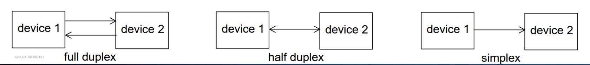
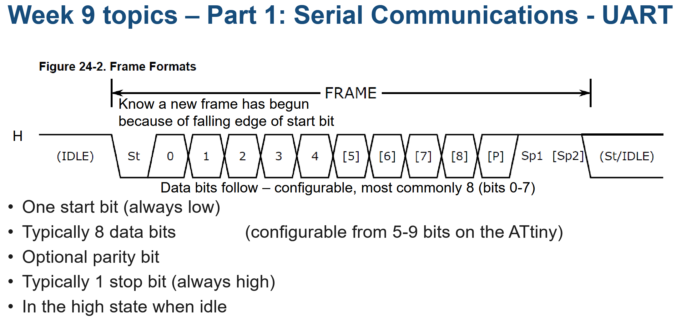
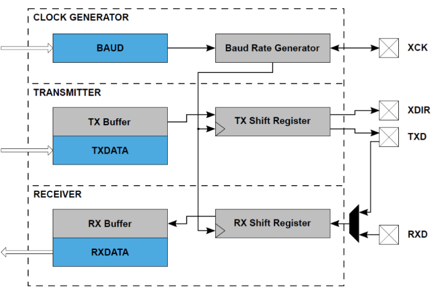

# week 9- Serial communication
- [x] Serial communication
- [x] UART/SPI on the ATtyny1626
- [x] UART/SPI applications on the QUTY
- [x] Strings

## Serial communication

### Example of common serial communications interfaces for microcontrollers:
#### Definitions:

* <Serial communication> is the process of sending data one bit at a time.
* <Two devices> (sender and receiver) must use the same protocol to communicate.
* Terminology:
  $$Transmit\ Tx\ \| Receive\ Rx$$
*  **Full-duplex:** can communicate in both directions at the same time
* **Half-duplex:** can communicate in both directions but not at the same time
*  **Simplex:** can communicate in only one direction


#### UART – Universal Asynchronous Receiver-Transmitter\
• Low cost, low complexity and widely used
• Both half- and full-duplex
• Asynchronous
• Modest speeds (typical 9600-115200 baud)
• Applications – RS-232, RS-485, RS-422, virtual COM port, inter-
microcontroller communication
#### SPI – Serial Peripheral Interface\
• Full-duplex\
• Synchronous\
• High speed (10-20 MHz)\
• Typically used for short distances between ICs (a few100’s mm)


#### I2C – Inter-Integrated Circuit\
• Half-duplex, Synchronous\
• Modest speeds (typically up to 400 kbaud)\
• Short distances (typically <300mm)\
• Devices use open drain outputs

#### CAN – Controller Area Network\
• Used in automotive, aerospace and industrial applications, safety critical systems\
• Half-duplex\
• Asynchronous\
• Speeds typically up to 1Mbaud\
• Medium distances (40-500m)\
• Very precise timing requirements, typically not found on a low cost microcontroller.



- The frame always **starts low**
- The [P]⇒ parity tells the receiver that the transmission is near to finish and adding the high state at the start, indicates that the frame is done.

## UART/SPI on the ATtyny1626

* User loads data into TXDATA.
*  Peripheral copies data into the TX **Shift Register.**
*   Peripheral automatically generates the required start, stop and parity bits.
*   Data is shifted out to the TXD pin one bit at a time.
  



* Multiple bytes can be queued up for transmission / receive
* Maximises throughput as gaps between TX frames is minimized.
* Reduces chance of receiver overflow (RXDATA being overwritten by new data before the user is able to read it)\
*  We don’t have to be as precise in our timing for writing to TXDATA and reading from RXDATA.

#### STUTUS REGISTER
+ RXDATAH
  
#### CONFIGURATION REGISTER
+ BAUD - baud rate
+ CTRLB - transmitter and receiver enable
+ CTRLA - interupt enable
+ CTRLC - mode, default: 8-bit, no parity, 1 stop bit

9600 8N1 = 9600 baud, 8 data bits per frame, No parity bit, 1 stop bit

$$9600\ 8N1$$
## UART/SPI applications on the QUTY

* The 7-segment display on the QUTy is interfaced to the microcontroller by a 74HC595 shift register
* A shift register is a device which translates a serial input or output into a parallel input or output
* The 74HC595 is interfaced via SPI
*  Bit values from SPI_MOSI are clocked into the shift register on each cycle of SPI_CLK.
*   A rising edge on DISP_LATCH will latch the contents of the shift register into Q0-Q7.

- Only one side of the 7-segment display can ever be lit at a time (determined by the digit select signal, driven by Q7)
- If we want both digits to be lit simultaneously, we need to rapidly switch between sides of the display
- If this is done rapidly enough it will appear (to the human eye) as if both sides of the display are lit, just with reduced brightness
- This is referred to as time multiplexing
- Use a periodic interrupt from a timer to refresh the display at regular time intervals
  
### Two digits, time-multiplexed display

## Strings
LITERALS
```c
char a= 'a';
char z= '\0'; // new byte
char n= '\n'; // new line
char r= 'r'; // carrage return
char q= '\''; //single quote
char o= '\30'; // octal character literal
char h= '\x6F'; //hex character literal

```

> Strings are sequence of character data
>The NUL terminator allows the function to know when the string ends
>  For instance, printf(ptr); will print the character at ptr, then the next character, and so on until the NUL terminator is encountered
### Accessing character in string

- because strings are just arrays/pointers, individual character can be accessed with the [ ] operator
```c
const char *h ="Hello workd."
char x =h[4]; // "o"
```
### Manipulating strings

```c
char h[]= "Hello world.";
h[11]= '!'; // Hello world!
char h[] = "Hello world.";
h[5] = '\0'; // "Hello"
//--------------------------------
char g[10] = "Good";
g[4] = 'b';
g[5] = 'y';
g[6] = 'e';
g[7] = '\0'; // "Goodbye"

/*
Pointers can be useful for modifying strings as well
The classic K&R technique for copying a string:
*/
const char *from = "Hello world";
char to[12];
const char *src = from;
char *dest = to;
while (*src != '\0') { // contain a bug in ( )
*dest++ = *src++;
}
```

```c
// strings 
char s[]= "CAB202"; // Creating a valuable s to contain "CAB202"

s[3]='\0';// From string s if you want to have just the first 3 char in the string:'\0' asigns null char from 4th position onward

```
### <String.h>
```c
/*
The <string.h> header file has prototypes for functions for working with strings
Some useful ones:
*/
strlen() 			// Get length of string
strcpy(), strncpy() // Copy string
memcpy() 			// Copy data
strcmp() 			// Compare strings
strchr(), strrchr() // Find char in string
strstr() 			// Find string in string
strcat() 			// Concatenate two strings
```
⇒ code I used to demonstrate _the ' ' around 0 is necessary attempting to use " " result into an error_

```c
#include "stdio.h"
int main()
{
    char s[]= "CAB202";
    printf("%s\n", s);
    s[3]='\0';
    printf("%s", s);
    return 0;
}
```

## Demo code 
- What is a void function if c
In C and many other programming languages, a `void` function is a type of function that doesn't return a value. It's used when you want a function to perform a task or execute a sequence of statements, but you don't need it to produce any specific result that needs to be returned to the caller.

```c
void functionName(parameters) {
    // Function body: Perform some task or operations
    // No return statement or a return statement without a value
}
```
```c
#include <stdio.h>

// Declaration of a void function
void printMessage() {
    printf("Hello, World!\n");
}
int main() {
    // Call the void function
    printMessage();
    return 0;
}
```

## <stdio.h>
### Putchar
```c
/*putchar() is a function in <stdio.h>
• It has the prototype:
*/
int putchar(int);
// The int argument passed to it is converted to unsigned char, then written to stdout. The function returns the character written.
putchar('H');
putchar('e');
putchar('l');
putchar('l');
putchar('o');
putchar('\n');

```

### Floating point conversion specifiers
```c
// %f: standard floating point display
printf("%f\n", 3.14159265); // "3.141593"
//• %e: exponential notation
printf("%e\n", 50000000.0); // "5.000000e+07"
//• %g: abbreviated form (will use either standard or exponential notation)

printf("%g\n", 3.14159265); // "3.14159"
printf("%g\n", 50000000.0); // "5e+07"
```
### Precision modifiers
```c
/*For floating point values, this indicates the number of digits after the decimal
point to show:
*/
printf("%.2f\n", 3.14159265); // "3.14"
//• Precision modifiers and minimum field width modifiers can be combined:
printf("%6.2f\n", 3.14159265); // " 3.14"
//• An optional '0' prefix can be used, to indicate that the number should be padded
// with 0s to meet the minimum field width:
printf("%06.2f\n", 3.14159265); // "003.14"

printf("%.5s\n", "Hello world"); // "Hello"

printf("%03d\n", 2); // "002"
printf("%.3d\n", 2); // "002"
```

### class code demo
```c

```